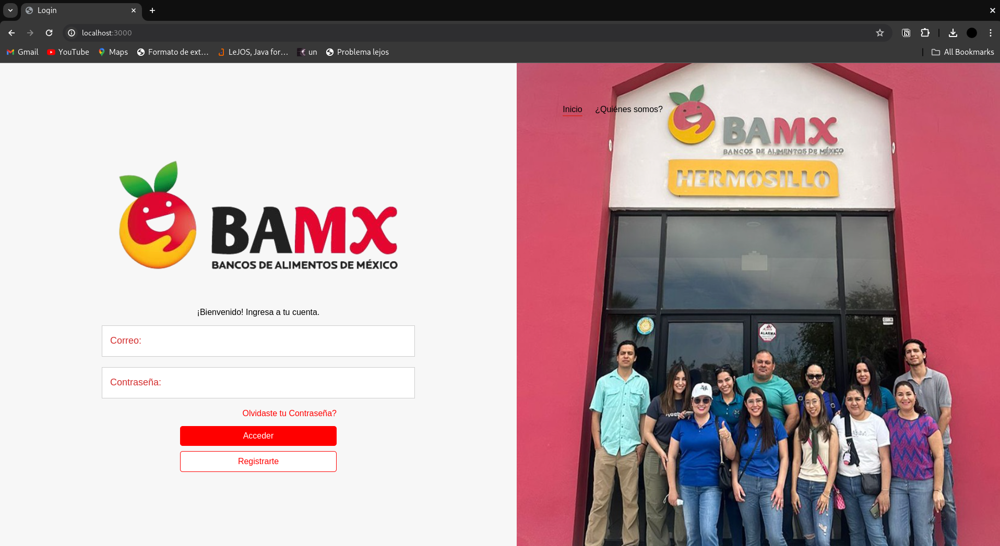

# Descripción
El proyecto consiste en el desarrollo de una página web interactiva y funcional utilizando tecnologías modernas como Node.js para el backend, CSS para el diseño y estilo, y MySQL como base de datos. El propósito principal de esta plataforma es proporcionar a los usuarios la capacidad de registrarse y crear una cuenta, así como iniciar sesión para acceder a funcionalidades personalizadas.

Una vez que los usuarios han iniciado sesión, se les concede acceso a un dashboard dinámico y visualmente atractivo que presenta datos sobre los pasajeros del accidente del Titanic. Estos datos nos permiten saber mas sobre el accidente del Titanic.

El dashboard está diseñado para ser una herramienta poderosa que facilita la visualización y gestión de grandes volúmenes de datos, ofreciendo funcionalidades como filtrado, clasificación y representación gráfica de la información. Esto no solo mejora la experiencia del usuario, sino que también proporciona una plataforma robusta para el análisis de datos y la toma de decisiones informadas.

Además, el sistema de autenticación asegura que solo los usuarios registrados y autorizados puedan acceder a la información sensible, garantizando la seguridad y privacidad de los datos. Este proyecto busca integrar de manera armoniosa y eficiente las capacidades de Node.js, CSS y MySQL para ofrecer una solución completa y accesible para la gestión de datos de producción alimentaria a escala global.

[](https://github.com/los-hambriados/banmx/blob/main/screenshot.png)

---
# Características

- El inicio de sesión se hace validando las credenciales que existan en una base de datos
- Todos los usuarios se guardan en esta base de datos, y esta base de datos se puede manipular atraves de la aplicación
- Las páginas son seguras, es decir, se necesita haber iniciado sesión para poder entrar, de otra manera, te regresará a que inicies sesión
---
### Objetivo General:
Desarrollar un software que haga uso de bases de datos para almacenar informacion de registro de usuario, asi como extraer informacion de las mismas y presentarla en un dashboard.

### Integrantes
 - [Braulio Sanchez](https://github.com/alesanchezb)
 - [Omar Pacheco](https://github.com/omarpach) 
 - [Ana Sofia Matti](https://github.com/venusielo) 
 - [Luis Mario Sainz](https://github.com/churroxd8) 
 - [David Ayala](https://github.com/jdayala111) 
 - [Daniel Alvarez](https://github.com/danuelalvarezt6) 
 - [Alfredo Arreola](https://github.com/curtax)

# Instalación

### Clonar el repositorio
```
git clone git@github.com:los-hambriados/banmx.git
```

### Configurar servidor de Node.js
```
cd banmx
npm i express morgan mysql express-myconnection
```

### Inicia la base de datos
- Solo la primera vez:
```
mysql -u root -p -e "CREATE DATABASE [nombre_base_datos];" 
```
- Siempre:
```
mysql -u root -p [nombre_base_datos] < database/db.sql                                   
```

### Iniciar el proyecto
Para iniciar el proyecto localmente:
```
npm run dev                                 
```
